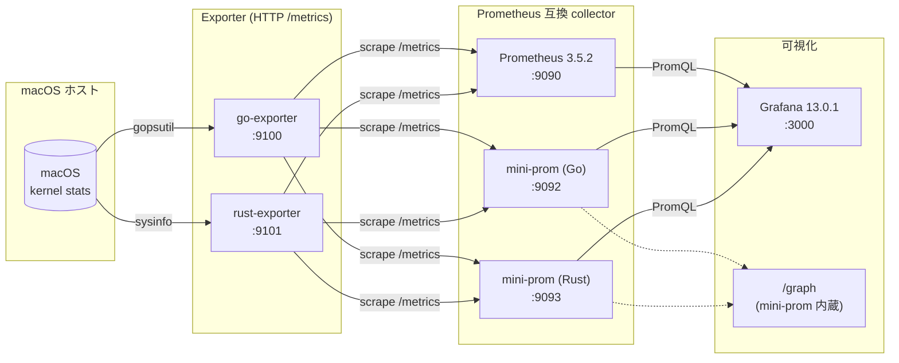
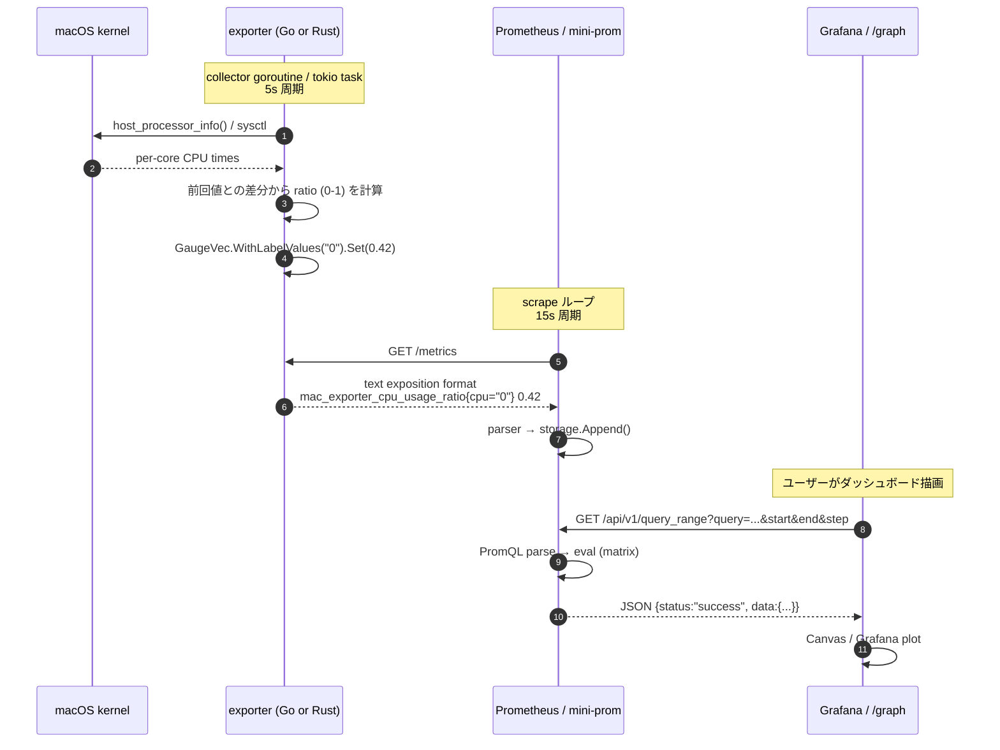
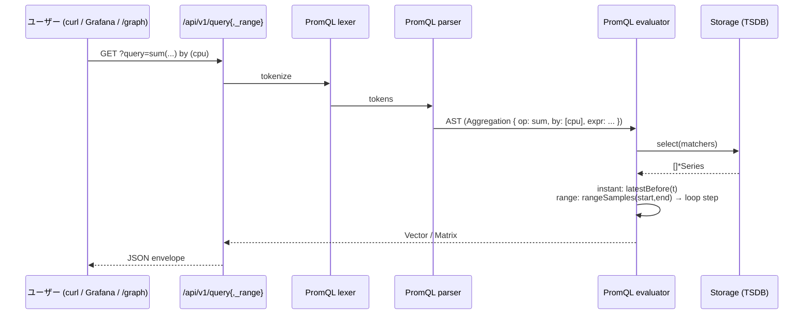
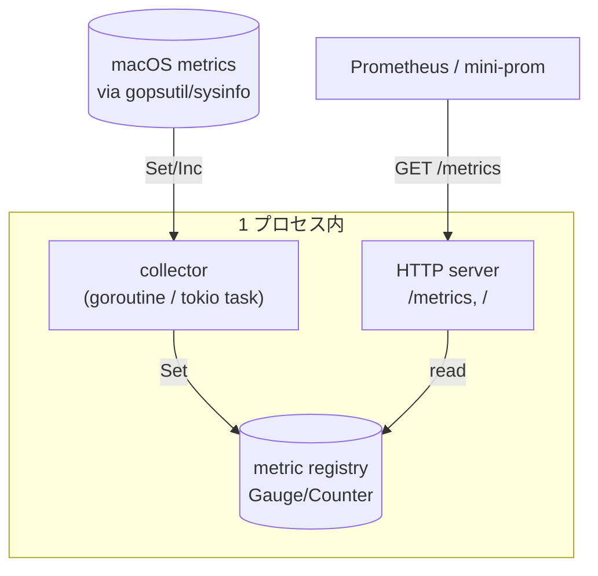
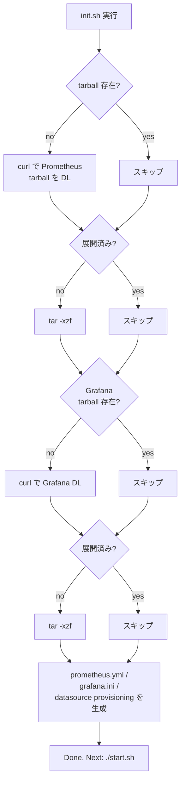
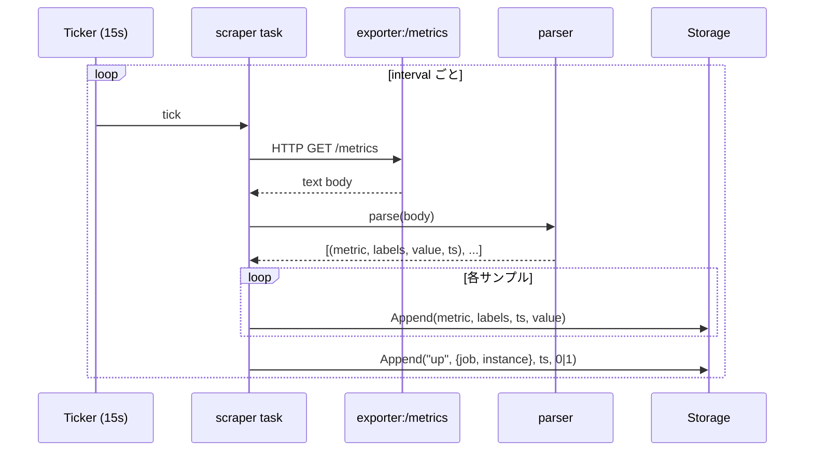
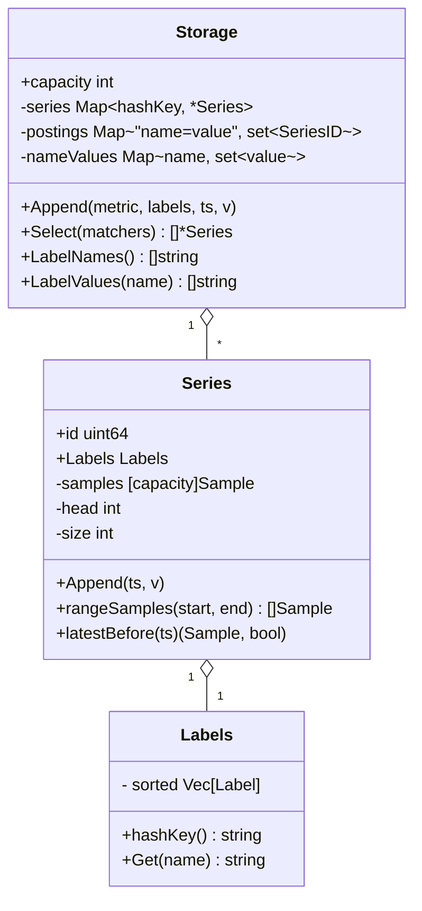
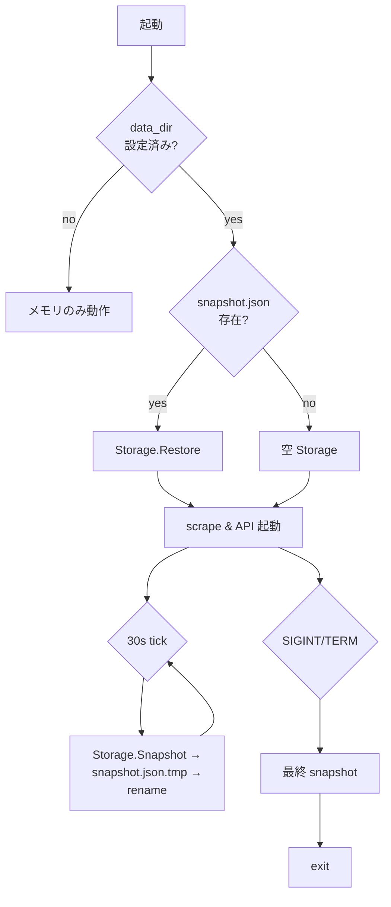
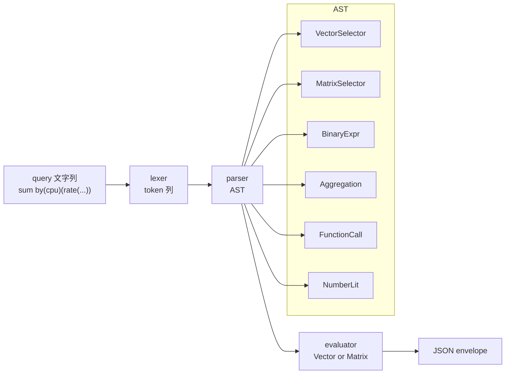

# poc/ アーキテクチャ & 実装ガイド

このドキュメントは `exporters/poc/` 配下のすべての PoC を、**「全体像 → データフロー → 各コンポーネント → 運用」** の順で読み解く資料です。
個別ディレクトリの README は使い方・設定値が中心ですが、ここでは **何が・なぜ・どう連携しているか** に焦点を当てます。

> 本文中の図はすべて [Mermaid](https://mermaid.js.org/) です。GitHub・VS Code のプレビュー等でそのまま描画されます。

---

## 1. 全体像

### 1.1 目的

macOS のホストメトリクス（CPU / メモリなど）を **取得・公開・収集・可視化する一連の系を自前で書く** のが poc 全体のテーマです。
本物のスタック（exporter + Prometheus + Grafana）と、それをミニマムに自作する mini-prometheus を並べて、両者の動作を比較できる構成にしてあります。

### 1.2 ディレクトリと役割

| ディレクトリ                | 役割                                                                                    | 既定ポート         |
| --------------------------- | --------------------------------------------------------------------------------------- | ------------------ |
| `mac/go-exporter/`          | macOS 向け Go 製の Prometheus exporter。`gopsutil` で計測 → `/metrics`                  | `9100`             |
| `mac/rust-exporter/`        | macOS 向け Rust 製の同等品。`sysinfo` で計測 → `/metrics`                                | `9101`             |
| `infra/`                    | 本物の Prometheus 3.5.2 + Grafana Enterprise 13.0.1 をローカル起動するスクリプト群       | `9090` / `3000`    |
| `mini-prometheus/go/`       | Prometheus 互換の **最小再実装**（Go）。scrape + TSDB + PromQL + HTTP API + 簡易 UI       | `9092`             |
| `mini-prometheus/rust/`     | 同等品（Rust、`axum` ベース）                                                           | `9093`             |

### 1.3 トポロジ



- **`kernel → exporter`** … gopsutil / sysinfo がシステムコールを発行して測定値を取得
- **`exporter → collector`** … Prometheus または mini-prom が定期的に `GET /metrics` を実行
- **`collector → UI`** … Grafana のデータソース、または mini-prom 自身の `/graph` から PromQL で参照

### 1.4 ポート一覧（衝突確認用）

| ポート | プロセス                | 備考                                        |
| ------ | ----------------------- | ------------------------------------------- |
| 3000   | Grafana                 | 既定。`infra/data/grafana-conf/grafana.ini` |
| 9090   | Prometheus              | 既定                                        |
| 9092   | mini-prom (Go)          | `mini-prometheus/go/config.toml`            |
| 9093   | mini-prom (Rust)        | `mini-prometheus/rust/config.toml`          |
| 9100   | go-exporter             | `poc/mac/go-exporter/config.toml`           |
| 9101   | rust-exporter           | `poc/mac/rust-exporter/config.toml`         |

---

## 2. データフロー

### 2.1 1 サンプルが流れる経路

1 つの CPU コアの使用率値が、計測 → 可視化に届くまで:



時間軸は **2 段階の周期**:

| 段              | 周期         | 設定箇所                                  |
| --------------- | ------------ | ----------------------------------------- |
| exporter 側収集 | 5s（既定）   | `poc/mac/{go,rust}-exporter/config.toml` の `collector.interval` |
| collector 側 scrape | 15s（既定） | Prometheus の scrape config / mini-prom の `scrape_configs.scrape_interval` |

「exporter が貯めて 5 秒毎に上書き、collector が 15 秒毎に取りに行く」関係なので、**collector が記録する値は最新のスナップショット**（5 秒以内の取得値）です。

### 2.2 PromQL クエリの一往復



---

## 3. exporter（Go と Rust）

### 3.1 共通設計

両実装は **同じメトリクス名・同じラベル・同じ意味** で `/metrics` を返します。
これにより同じ Prometheus / Grafana ダッシュボードがどちらでも使えます。



- **収集モデル**: `interval` 周期にバックグラウンドで取得 → registry の Gauge を更新するだけ。`/metrics` ハンドラはレジストリをスナップショット出力するだけで重い処理は行わない
- **CPU 計算の差分**: 起動時に「シード呼び出し」を 1 回入れて、1 周目から有効な使用率が出るようにしている

### 3.2 公開メトリクス

| メトリクス                                            | 型      | ラベル | 値域       |
| ----------------------------------------------------- | ------- | ------ | ---------- |
| `mac_exporter_cpu_usage_{ratio,percent}`                | Gauge   | `cpu`  | 0-1 / 0-100 |
| `mac_exporter_memory_total_bytes`                       | Gauge   | -      | bytes      |
| `mac_exporter_memory_used_bytes`                        | Gauge   | -      | bytes      |
| `mac_exporter_memory_available_bytes`                   | Gauge   | -      | bytes      |
| `mac_exporter_memory_used_{ratio,percent}`              | Gauge   | -      | 0-1 / 0-100 |
| `mac_exporter_swap_total_bytes`                         | Gauge   | -      | bytes      |
| `mac_exporter_swap_used_bytes`                          | Gauge   | -      | bytes      |
| `mac_exporter_swap_used_{ratio,percent}`                | Gauge   | -      | 0-1 / 0-100 |
| `mac_exporter_collector_last_success_timestamp_seconds` | Gauge   | -      | unix sec   |
| `mac_exporter_collector_errors_total`                   | Counter | `source` | (Go 側のみ) |

`cpu="total"` ラベルが per-core 値の単純平均、`cpu="0".."N-1"` が各論理コア。
比率系（cpu/memory/swap usage）の単位は `[collector] unit = "ratio"`（既定、0-1）か `unit = "percent"`（0-100）で切り替え。
切り替えるとメトリクス名末尾も `*_ratio` / `*_percent` で変わるので、Grafana 側のクエリと合わせて差し替える。

### 3.3 言語別の依存

| 役割              | Go                                    | Rust                                |
| ----------------- | ------------------------------------- | ----------------------------------- |
| HTTP             | `net/http`（標準）                     | `axum 0.7`                          |
| metrics クライアント | `prometheus/client_golang` (公式)      | `prometheus-client 0.22` (公式)     |
| 計測              | `gopsutil/v4`                         | `sysinfo 0.32`                      |
| 設定              | `BurntSushi/toml`                     | `serde` + `toml` + `humantime-serde`|

---

## 4. infra（Prometheus + Grafana スタック）

### 4.1 init.sh の責務

`infra/init.sh` は **冪等** な「ダウンロード + 展開 + 設定生成」スクリプト。3 段階で動く。



### 4.2 生成される設定の中身

`data/prometheus.yml`（init.sh が書き出す）:

```yaml
scrape_configs:
  - job_name: prometheus
    static_configs: [{ targets: ['localhost:9090'] }]
  - job_name: mac_exporter_go
    static_configs: [{ targets: ['localhost:9100'] }]
  - job_name: mac_exporter_rust
    static_configs: [{ targets: ['localhost:9101'] }]
```

`data/grafana-conf/provisioning/datasources/prometheus.yml`:

```yaml
apiVersion: 1
datasources:
  - name: Prometheus
    type: prometheus
    url: http://localhost:9090
    isDefault: true
```

→ Grafana 起動時に **Prometheus データソースが自動登録** されるので、ログイン直後に Explore で PromQL を実行できる。

### 4.3 start.sh / stop.sh

`start.sh` は両プロセスを `nohup` でバックグラウンド起動し、PID と log を `data/` 配下に置く。
`stop.sh` は PID ファイル経由で SIGTERM、10 秒待って SIGKILL。

| サービス   | PID                                | ログ                                 |
| ---------- | ---------------------------------- | ------------------------------------ |
| Prometheus | `data/prometheus.pid`              | `data/logs/prometheus.log`           |
| Grafana    | `data/grafana.pid`                 | `data/logs/grafana.log`              |

---

## 5. mini-prometheus（自作 Prometheus 互換）

PoC で一番濃い部分。Prometheus 本体に相当する **scrape + TSDB + PromQL + HTTP API + 簡易 UI** を Go と Rust で並行実装。
**API レスポンスの JSON 形は本物と互換** なので、Grafana のデータソース URL を `:9092` / `:9093` に向けるだけで本物と差し替え可能。

### 5.1 全体構成

```mermaid
flowchart LR
  subgraph mini["mini-prometheus プロセス"]
    direction TB
    sm[ScrapeManager]
    pa[parser<br/>text exposition]
    st[(Storage<br/>ring buffer + index)]
    snap[snapshot<br/>JSON file]
    pq["PromQL engine<br/>lex → parse → eval"]
    api["HTTP API<br/>/api/v1/*"]
    web["UI<br/>/ , /graph"]
  end

  ext1["go-exporter<br/>:9100"] -->|HTTP /metrics| sm
  ext2["rust-exporter<br/>:9101"] -->|HTTP /metrics| sm

  sm --> pa --> st
  st <-.snapshot.-> snap

  user["ユーザー / Grafana"] -->|GET /api/v1/query[range]| api
  api --> pq --> st
  user -->|GET /graph| web --> api
```

### 5.2 scrape ループ

各 `[[scrape_configs]]` ジョブごとに **target × goroutine（Go） / tokio task（Rust）** が立ち上がり、`scrape_interval` 周期で `GET /metrics` を打つ。レスポンス本文を text-format パーサに通し、`(metric, labels, value)` を Storage に Append する。



`up{job, instance}` は scrape 成功で 1、失敗で 0 を入れる Prometheus 互換のメタ系列。

### 5.3 Storage（時系列ストレージ）

メモリ上の **「リングバッファ + posting index」** という最小構成。



- **Series ID**: ラベル全体の `name=value\0...` ハッシュキーで一意
- **リングバッファ**: 各 Series が `capacity`（既定 720 = 15s × 3h）のサンプル配列。head + size で論理範囲を表す
- **posting index**: `(labelName, labelValue) -> SeriesID 集合`。Selector の高速化用（現実装では Select は全 series を走査してマッチャを当てているが、将来最適化の足場として持っている）
- **古いサンプルの回収**: 上書きされるだけ。ほぼ追加コストなし

### 5.4 永続化（snapshot）

メモリだけだと再起動でデータが消えるので、**JSON 1 ファイルに全 Series をダンプ + 起動時に復元** する仕組みを追加。



- **アトミック書き込み**: `snapshot.json.tmp` に書いてから rename。中断時の半端ファイルを避ける
- **Go と Rust でファイル形式は別**: Go は `encoding/json` のデフォルト命名（`Name`, `Value`）、Rust は idiomatic な lowercase。**同じディレクトリで使い回さない** こと
- **無効化**: `data_dir = ""` で完全 in-memory に戻る。`snapshot_interval = "0s"` で起動時 load + 終了時 save のみ

### 5.5 PromQL エンジン

`mac_exporter` の用途に必要なものに絞ったサブセット。



**対応している主要要素**:

- ベクタセレクタ（`metric{label="x"}`）/ 範囲セレクタ（`metric[5m]`）
- 二項演算（`+ - * / %`、比較）
- 集約: `sum / avg / max / min / count by | without`
- 関数: `rate, irate, increase, delta, *_over_time, time, vector, scalar, abs, clamp_min, clamp_max`
- `offset` 修飾子

**意図的に非対応**（`bad_data` を返す）: `topk` / `bottomk` / `quantile` / `histogram_quantile` / `or` / `and` / `unless` / on/ignoring/group_left/group_right / subquery / `@` 修飾子 / recording・alerting rules

### 5.6 HTTP API

```
GET /api/v1/query?query=...&time=...
GET /api/v1/query_range?query=...&start=...&end=...&step=...
GET /api/v1/labels
GET /api/v1/label/{name}/values
GET /api/v1/series?match[]=...
GET /api/v1/targets
GET /api/v1/status/buildinfo
GET /api/v1/metadata
GET /-/healthy
GET /-/ready
GET /            ← UI: target health 一覧
GET /graph       ← UI: PromQL 式ブラウザ
```

JSON エンベロープは Prometheus 互換:

```json
{
  "status": "success",
  "data": {
    "resultType": "vector",
    "result": [
      { "metric": {"__name__":"up","job":"mac_exporter_go"}, "value": [1777192400.123, "1"] }
    ]
  }
}
```

### 5.7 /graph UI

外部依存ゼロの単一 HTML（`graph.html` を Go の `embed` / Rust の `include_str!` でバイナリに焼き込み）。

- 上部: PromQL 入力欄、Instant / Range 切り替え、Range 幅・Step・終端時刻
- 下部: Range は Canvas で折れ線、Instant はテーブル
- ネットワーク取得は `fetch('/api/v1/query[_range]')` のみ。サードパーティ JS 不使用

```mermaid
flowchart LR
  expr[式入力] -->|submit| js[graph.html JS]
  js -->|fetch| api[/api/v1/query_range]
  api --> json[(JSON)]
  json --> draw[Canvas drawChart]
  draw --> chart[折れ線 + 凡例]
```

---

## 6. 言語間の対比

両実装の「同じ機能をどう書くか」のスナップショット:

| 観点                  | Go                                    | Rust                                  |
| --------------------- | ------------------------------------- | ------------------------------------- |
| HTTP                  | `net/http` (stdlib)                   | `axum 0.7` (tokio)                    |
| 並列モデル             | goroutine + channel                   | tokio タスク + `Arc<RwLock<...>>`     |
| HTTP クライアント      | `net/http`                            | `reqwest 0.12` (rustls)               |
| 設定                  | `BurntSushi/toml`                     | `serde` + `toml` + `humantime-serde`  |
| 静的アセット          | `//go:embed graph.html`               | `include_str!("../graph.html")`       |
| シリアライズ           | `encoding/json`（フィールド名そのまま）   | `serde_json`（`#[serde(...)]`で改名可）|
| シャットダウン        | `signal.NotifyContext` + `Server.Shutdown` | `signal::ctrl_c` + `with_graceful_shutdown` |
| バイナリサイズ        | ~12MB                                 | ~10MB（release）                       |

**設計思想は同じ**:

- バックグラウンドタスクが計測 / scrape を回し、結果は読み取り専用にレジストリ or storage に置く
- HTTP ハンドラは集計済みデータを読むだけで重い処理は行わない
- snapshot 等の I/O は専用ループ + アトミック書き込み

---

## 7. 運用ライフサイクル

### 7.1 一発起動・停止の手順

```sh
# 起動順（依存先から）
cd exporters/poc/mac/go-exporter   && ./start.sh   # :9100
cd ../rust-exporter                && ./start.sh   # :9101
cd ../../infra                     && ./init.sh    # 初回のみ
cd .                               && ./start.sh   # :9090, :3000
cd ../mini-prometheus/go           && ./start.sh   # :9092 (任意)
cd ../rust                         && ./start.sh   # :9093 (任意)

# 停止（逆順）
cd ../rust                         && ./stop.sh
cd ../go                           && ./stop.sh
cd ../../infra                     && ./stop.sh
cd ../mac/rust-exporter            && ./stop.sh
cd ../go-exporter                  && ./stop.sh
```

### 7.2 各サービスの runtime ファイル配置

```
poc/
├── mac/
│   ├── go-exporter/
│   │   ├── mac_exporter_go            ← go build 成果物 (gitignore)
│   │   └── .run/
│   │       ├── exporter.pid
│   │       └── exporter.log
│   └── rust-exporter/
│       ├── target/                    ← cargo (gitignore)
│       └── .run/
│           ├── exporter.pid
│           └── exporter.log
├── infra/
│   └── data/                      ← gitignore
│       ├── downloads/                    ← tarball キャッシュ
│       ├── prometheus-3.5.2.darwin-arm64/
│       ├── grafana-enterprise-13.0.1/
│       ├── prometheus.yml
│       ├── grafana-conf/
│       ├── prometheus-data/              ← TSDB
│       ├── grafana-data/                 ← grafana SQLite
│       ├── prometheus.pid / .log
│       └── grafana.pid / .log
└── mini-prometheus/{go,rust}/
    ├── data/                      ← snapshot.json (gitignore)
    └── .run/
        ├── server.pid
        └── server.log
```

### 7.3 設定変更箇所まとめ

| 変えたい項目                  | 編集対象                                                   |
| ----------------------------- | ---------------------------------------------------------- |
| exporter ポート               | `poc/mac/{go,rust}-exporter/config.toml`                   |
| exporter 収集間隔             | 同上 `collector.interval`                                  |
| Prometheus / Grafana ポート   | `infra/init.sh`（変数）→ 再 init                            |
| Prometheus scrape 対象        | `infra/init.sh` の `prometheus.yml` ヒアドキュメント       |
| mini-prom scrape 対象 / 間隔  | `mini-prometheus/{go,rust}/config.toml`                    |
| mini-prom 永続化              | 同上 `[storage] data_dir`, `snapshot_interval`             |

---

## 8. トラブルシュート集

| 症状                                              | 原因                                                | 対処                                                              |
| ------------------------------------------------- | --------------------------------------------------- | ----------------------------------------------------------------- |
| `nohup: ./bin/grafana: Bad CPU type in executable` | amd64 Grafana を Apple Silicon で実行              | Rosetta 2 を入れる、または arm64 ビルド (Enterprise) に切り替え   |
| Grafana `/api/folders` が 500: `IDX_team_org_id`  | unified storage の SQLite migration が中途半端     | Grafana 停止 → `rm -rf data/grafana-data` → `./start.sh` で再初期化 |
| `start.sh` 実行しても 9090 / 3000 が listen しない | 既存の同名プロセスや古い PID ファイルが残っている  | `pkill -KILL -f prometheus`, `pkill -KILL -f grafana` でクリア再起動 |
| mini-prom にアクセスしても 404                    | URL ポートタイポ（`:9002` vs `:9092`）             | `lsof -i :9092 -P -n` で実際の listen を確認                       |
| `mac_exporter_collector_errors_total` が増えない    | Rust 側はそもそも未公開（sysinfo がエラー返さない） | Go 側でのみ参照                                                    |
| 再起動でデータが消える                            | mini-prom の `data_dir` が空、または書込権限なし    | `config.toml` の `[storage] data_dir = "data"` を確認、`data/snapshot.json` の存在を確認 |

---

## 9. 参考: ファイル単位のコード配置

```
poc/mac/go-exporter/        ─ main.go, config.go, collector.go
poc/mac/rust-exporter/src/  ─ main.rs, config.rs, collector.rs

poc/infra/              ─ init.sh, start.sh, stop.sh

poc/mini-prometheus/go/
  main.go         ─ ブートストラップ + 定期 snapshot ループ
  config.go       ─ TOML 読み込み
  scrape.go       ─ ScrapeManager
  parser_textfmt.go ─ exposition format パーサ
  storage.go      ─ ring buffer + posting index
  snapshot.go     ─ JSON dump / restore
  promql_lex.go   ─ tokenizer
  promql_parse.go ─ AST 構築
  promql_eval.go  ─ instant/range 評価
  api.go          ─ /api/v1/* ハンドラ
  web.go          ─ index + /graph
  graph.html      ─ embed される PromQL UI

poc/mini-prometheus/rust/src/
  main.rs / config.rs / scrape.rs / parser.rs
  storage.rs / snapshot.rs
  promql/ {mod.rs, lex.rs, parse.rs, eval.rs}
  api.rs / web.rs
  ../graph.html  ─ include_str! される
```

---

## 10. 「次にどこを触ると面白いか」

- **lab/ で見つかった macOS 固有メトリクス（per-disk I/O, vm_stat 圧縮メモリ等）を exporter に追加** → exporter 側 Collector を増やすだけ。スクレイプ系統は既に通っている
- **mini-prom に追記 WAL を入れる** → 現状は snapshot のみ、サンプル単位の append-only ログを足せば本物の Prometheus に近づく
- **mini-prom の posting index を Select で実際に使う** → 現状は全 Series 走査。`AND` で series 集合を絞る実装を入れると大幅に高速化
- **PromQL の `topk` / `quantile` 実装** → 集約ノードの拡張だけで足りるはず
- **ダッシュボード自動 provisioning** → `infra/data/grafana-conf/provisioning/dashboards/` に JSON を置けば自動登録される
